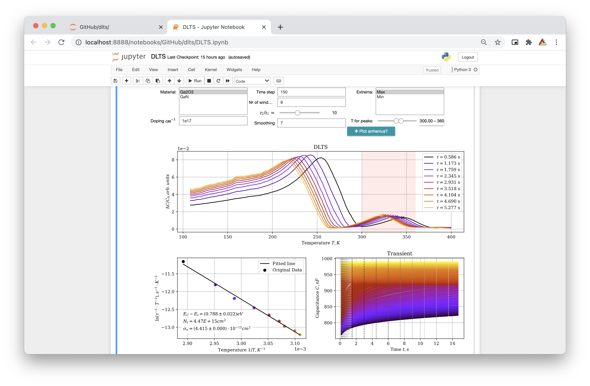

# DLTS

 
Deep-Level Transient Spectroscopy – powerful tool to study electrically active defects (known as charge carrier traps) in semiconductors. DLTS establishes fundamental defect parameters and measures their concentration in the material. Some of the parameters are considered as defect "fingerprints" used for their identifications and analysis.

